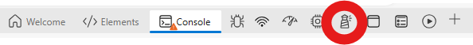
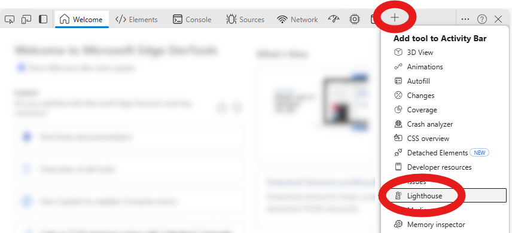
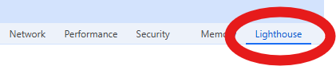
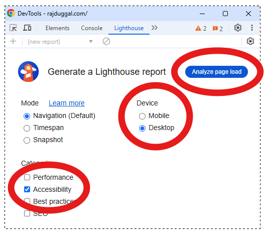

+++
title = "How to Run a Quick, Simple and Free, Web Accessibility Test Audit"
description = "You don't need to download or install any special software. Both Chrome and the Edge browsers have a built-in web accessibility auditing tool, ready for you to use!"
summary = "You don't need to download or install any special software. Both Chrome and the Edge browsers have a built-in web accessibility auditing tool, ready for you to use!"
ShowPostNavLinks = false
+++

Chrome and Edge have a built-in tool called [Lighthouse](https://developer.chrome.com/docs/lighthouse/overview) which can audit the web page you're visiting in both desktop browser and mobile browser modes.

There's a [Lighthouse add-on available for Firefox](https://addons.mozilla.org/en-US/firefox/addon/google-lighthouse/).

Sorry, Safari browser users will need to find another tool for this job.

## Step 1: Open the built-in Developer Tools

* Open your Google Chrome or Microsoft Edge browser
* Visit the web page that you want to analyze.
* In the top-right corner, click the gray icon that contains a line of three dots.
* Click "__More tools__".
* Click "__Developer Tools__".

## Step 2: Open the Lighthouse tab 

If you're using Edge look for the "Lighthouse" tool in your activity bar. It will either say "Lighthouse" or it might be displayed as a lighthouse icon.

If it's missing, you will need to add it to your Activity Bar by clicking the plus icon and then click "Lighthouse".

If you're using Chrome and you don't see Lighthouse, click the icon with two arrows pointing towards the right to find it.

You will know you have the Lighthouse tab displayed and active when the Lighthouse tab is underlined and in a blue font colour. Like this...

## Step 3: Configure the test report

* Under the _Category_ section, only select the "__Accessibility__" checkbox and uncheck the others.
* Choose to generate the report for either how the web page will be displayed in "__Desktop__" computer mode, or "__Mobile__" phone mode.
* Click the "__Analyze page load__" button to generate your report.

## Step 4: Enjoy the report!

Check your audit score...

Did it score 100%?

Yipee!

Wait!

Don't get too excited!

This score ___only___ measures a [set of __automated__ accessibility audit tests](https://developer.chrome.com/docs/lighthouse/accessibility/scoring).

It's still necessary to perform [__manual accessibility testing__](https://web.dev/learn/accessibility/test-manual), which  uses keyboard, visual, and cognitive tests to find issues that automated tools cannot.

Fortunately, there's plenty of resources online.

And, if you still need help you can __[reach out to a web accessibility expert like me!](https://clarity.fm/rajduggal/precall/free)__

