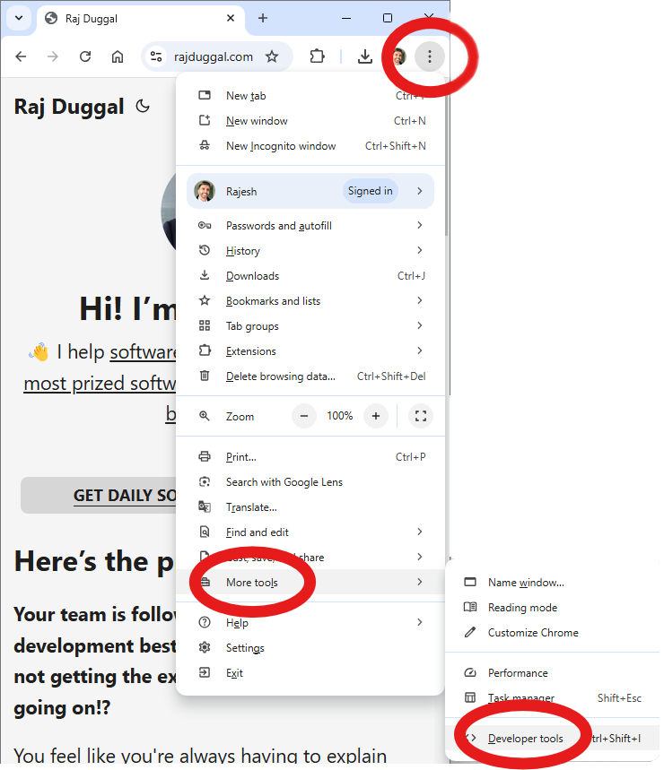
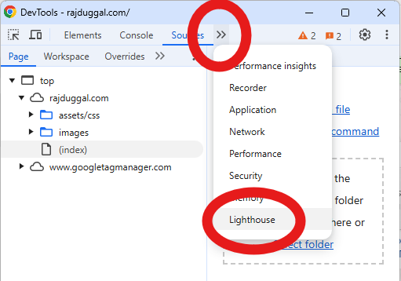
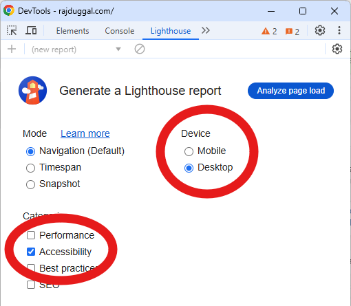

+++
title = "How to do a Quick, Simple, and Free, Web Accessibility Test Report"
description = "You don't need to download or install anything. Your chrome browser already has a built in free web Accessibility analysis and reporting tool."
ShowPostNavLinks = false
+++

Chrome has a built in tool called [Lighthouse](https://developer.chrome.com/docs/lighthouse/overview) which can audit the web page you're visiting in both desktop browser and mobile browser modes.

## Step 1. Open the built in [Chrome Developer Tools](https://developer.chrome.com/docs/devtools)

## Step 2. Open the Lighthouse tab 

## Step 3. Configure the test report

Check the "Accesibility" Checkbox, and run the test for either how the web page will be displayed in desktop computer mode, or mobile phone mode. Then click the "Analyze page load" button, and it will start analyzing the web page and generate a report.

## Step 4. Enjoy the report!

You can get more information about how this report is generated and [how the score is determined](https://developer.chrome.com/docs/lighthouse/accessibility/scoring).

